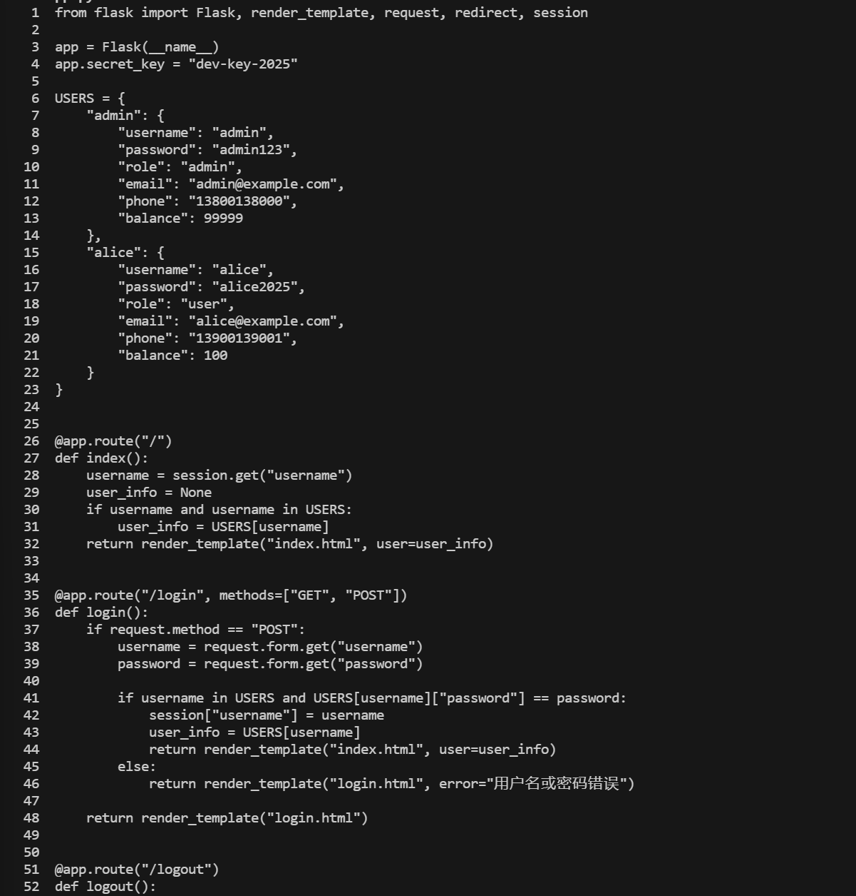
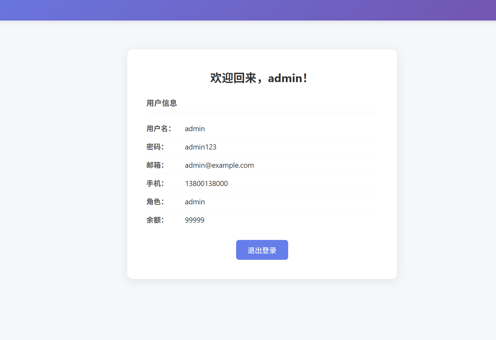
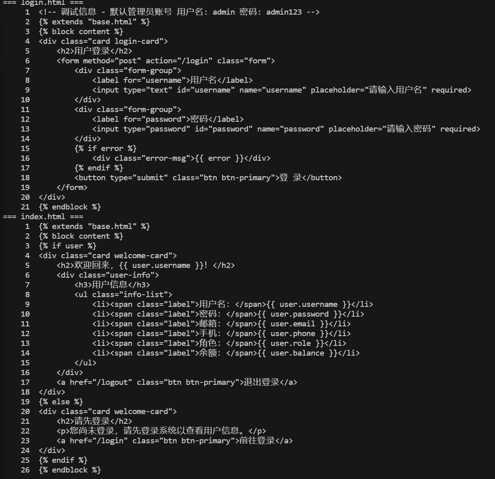
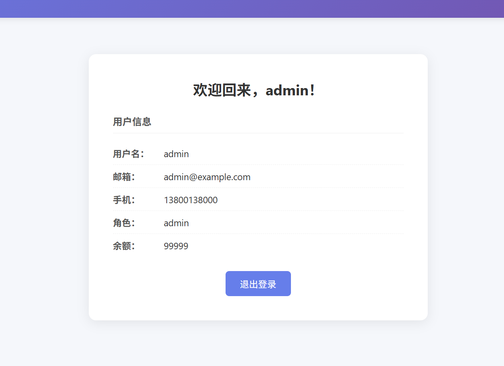
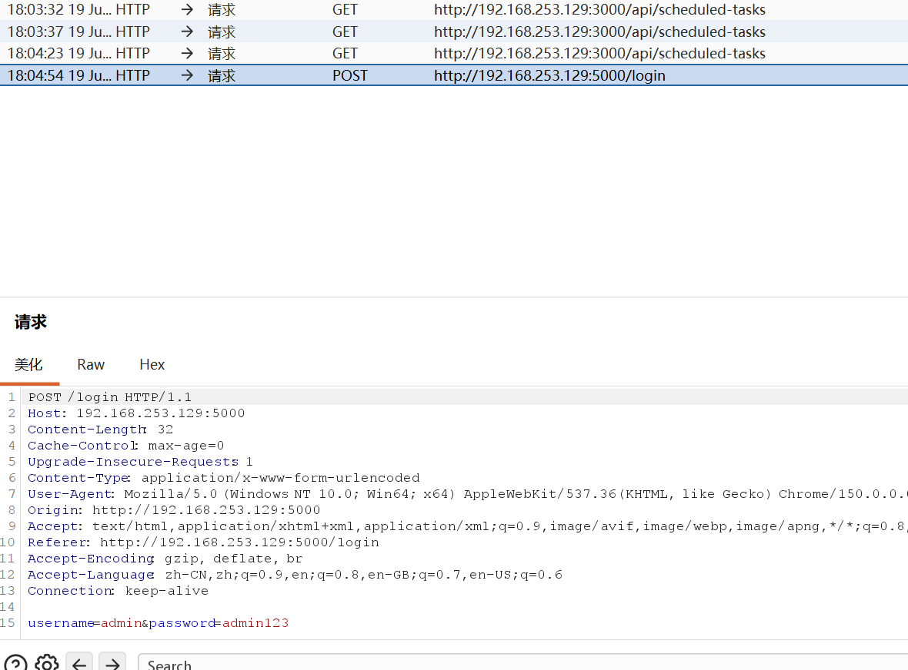
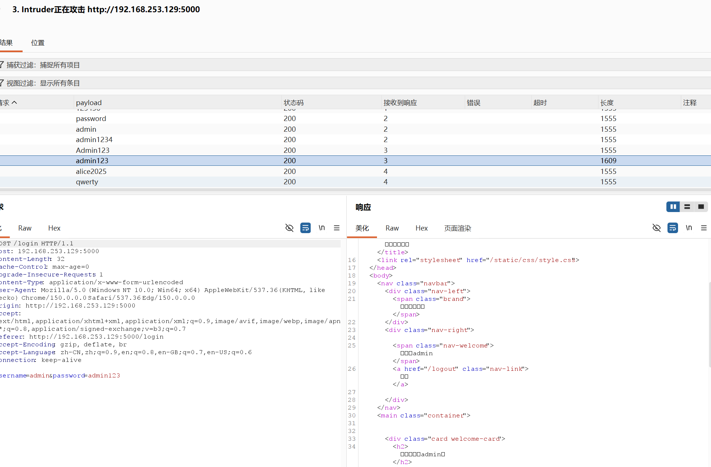

# Class01 用户信息管理平台漏洞修复报告

| 项目 | 内容 |
|------|------|
| **报告名称** | Class01 用户信息管理平台漏洞修复报告 |
| **姓名** | 王文杰 |
| **学号** | 2024141530132 |
| **报告日期** | 2026-07-19 |
| **项目路径** | `/opt/Class01` |

---

## 一、项目概述

Class01 是一个基于 Python Flask 3.1.3 构建的简易用户信息管理平台，提供用户登录、信息展示和退出功能。本报告针对该项目的原始漏洞版本（Day1 提交 `38f2e1f`）进行了系统的安全分析，并在修复版本（Day2 提交 `e72a599`）中对识别出的漏洞逐一修复。报告详细记录了每个漏洞的风险评估、证据、修复方案及复测结果。

## 二、测试授权与范围

本次安全测试严格限定于本人 Kali 虚拟机（`127.0.0.1:5000`、`192.168.253.129:5000`），测试对象为 `/opt/Class01` 项目的原始漏洞版本（Day1 提交 `38f2e1f`）。所有测试操作均针对本人创建的课程项目，在隔离的本地实训环境中完成，未对任何第三方系统造成影响。

## 三、测试环境

| 项目 | 配置 |
|------|------|
| 操作系统 | Kali Linux |
| Python 版本 | 3.13 |
| Web 框架 | Flask 3.1.3 |
| 测试工具 | Burp Suite、浏览器开发者工具、curl |
| 数据库 | 无（内存字典 USERS） |
| 测试地址 | http://127.0.0.1:5000 |

## 四、修复前基线

原始版本（Day1，提交 `38f2e1f`）代码以最简方式实现功能，完全忽略安全防护。密码以明文形式存储在 `USERS` 字典中，通过 `==` 直接比较；会话密钥硬编码为 `"dev-key-2025"`；Flask 以 `debug=True` 模式监听 `0.0.0.0`；登录和退出无任何 CSRF 或频率限制。

### 原始版本关键代码

```python
app.secret_key = "dev-key-2025"

USERS = {
    "admin": {
        "password": "admin123",  # 明文密码
        # ...
    },
}

# 登录验证
if username in USERS and USERS[username]["password"] == password:
    session["username"] = username
    user_info = USERS[username]  # 完整字典传递给模板
    return render_template("index.html", user=user_info)

if __name__ == "__main__":
    app.run(debug=True, host="0.0.0.0", port=5000)
```

## 五、漏洞汇总表

| 编号 | 漏洞名称 | 风险等级 | 修复状态 |
|------|---------|---------|---------|
| V-01 | 密码明文存储与直接比对 | **高危** | ✅ 已修复 |
| V-02 | 页面泄露明文密码 | **中危** | ✅ 已修复 |
| V-03 | HTML 注释泄露默认管理员账号 | **中危** | ✅ 已修复 |
| V-04 | Secret Key 硬编码 | **高危** | ✅ 已修复 |
| V-05 | Debug 模式永久开启 | **高危** | ✅ 已修复 |
| V-06 | 登录接口无频率限制 | **中危** | ✅ 已修复 |
| V-07 | 无 CSRF 防护 / GET 退出 | **高危** | ✅ 已修复 |
| V-08 | Session 无过期和 Cookie 安全配置 | **中危** | ✅ 已修复 |
| V-09 | 缺少安全响应头 | **中危** | ✅ 已修复 |
| V-10 | 缺少输入长度与请求体限制 | **低危** | ✅ 已修复 |
| V-11 | 响应耗时可枚举用户身份 | **低危** | ✅ 已修复 |

## 六、漏洞详情

### V-01 密码明文存储与直接比对

- **风险等级**：高危
- **漏洞描述**：`USERS` 字典中直接存储密码明文（`"password": "admin123"`），登录时使用 `==` 直接比对。数据库泄露将导致所有用户密码直接暴露；传输与存储均无加密保护，攻击者可轻易获取凭据。
- **攻击场景**：攻击者通过任意手段（SQL 注入、文件读取、备份泄露）获取源代码或内存数据，即可直接读取所有用户的明文密码。
- **证据**：原始 `app.py` 第 8～22 行。

  

- **修复方案**：使用 Werkzeug 的 scrypt（基于 RFC 7914）密码哈希算法。移除了明文 `password` 字段，替换为 `password_hash`。登录时使用 `check_password_hash(stored_hash, password)` 进行安全比对。
- **修复代码位置**：`app.py` 第 31～48 行（哈希常量定义）和第 76～82 行（登录校验逻辑）。
- **复测结果**：使用原始密码登录功能正常；`app.py` 中已无明文密码字段，`grep "admin123"` 无结果，无法通过静态分析获取用户密码。

### V-02 页面泄露明文密码

- **风险等级**：中危
- **漏洞描述**：`index()` 函数将 `USERS[username]` 完整字典传递给 `index.html` 模板，模板第 10 行直接渲染 `{{ user.password }}`。登录后任意用户均可看到自己（在管理员展示时则看到管理员）的明文密码。
- **攻击场景**：用户登录后截图或查看页面源代码即可获取密码；若同一页面展示其他用户信息也将一并泄露。
- **证据**：原始 `index.html` 第 10 行。

  

  

- **修复方案**：新增 `safe_user_info()` 函数（`app.py` 第 56～66 行），只返回 `username`、`role`、`email`、`phone`、`balance` 五个公开字段，`password_hash` 不进入模板上下文。`index.html` 移除了密码行。
- **修复代码位置**：`app.py` 第 56～66 行（`safe_user_info` 函数）；`index.html`（已删除密码字段）。
- **复测结果**：登录后页面不再显示密码字段。

  

### V-03 HTML 注释泄露默认管理员账号

- **风险等级**：中危
- **漏洞描述**：`login.html` 第 1 行以 HTML 注释形式写入 `<!-- 调试信息 - 默认管理员账号 用户名: admin 密码: admin123 -->`。查看网页源代码即可获得管理员凭据。
- **攻击场景**：攻击者访问登录页面，通过浏览器"查看页面源代码"即可获取 admin 账号密码。
- **证据**：原始 `login.html` 第 1 行。
- **修复方案**：删除该行 HTML 注释。
- **修复代码位置**：`login.html`（已删除注释行）。
- **复测结果**：查看登录页源代码，已无账号密码注释。

### V-04 Secret Key 硬编码

- **风险等级**：高危
- **漏洞描述**：`app.secret_key = "dev-key-2025"` 将会话签名密钥硬编码在源代码中。所有部署该代码的实例使用相同密钥，攻击者可伪造任意 session Cookie 冒充任意用户。
- **攻击场景**：攻击者解析出 `"dev-key-2025"` 后，使用 `itsdangerous` 库签名伪造 session Cookie，无需密码即可登录任意账号。
- **证据**：原始 `app.py` 第 4 行。
- **修复方案**：优先从环境变量 `SECRET_KEY` 读取；未配置时使用 `secrets.token_hex(32)` 自动生成 64 字符随机密钥，不再硬编码。
- **修复代码位置**：`app.py` 第 14～15 行（`app.config.update` 中的 `SECRET_KEY`）。
- **复测结果**：`app.py` 中 `grep "secret_key"` 仅返回 `SECRET_KEY`（配置键名），无任何固定值。

### V-05 Debug 模式永久开启

- **风险等级**：高危
- **漏洞描述**：`app.run(debug=True)` 强制开启 Werkzeug 调试器。调试器在发生异常时提供交互式 Python shell（需 PIN 码），若 PIN 码被推算，攻击者可获得服务器远程代码执行（RCE）权限。同时监听 `0.0.0.0` 导致局域网内任意设备均可访问。
- **攻击场景**：攻击者触发应用异常（如访问不存在的路由），Werkzeug 调试器界面将展示完整调用栈，结合推算出的 PIN 码即可执行任意系统命令。
- **证据**：原始 `app.py` 第 57～58 行。
- **修复方案**：`FLASK_DEBUG` 环境变量设为 `"1"` 时才启用调试模式，默认关闭；监听保持 `0.0.0.0` 以支持局域网访问测试。
- **修复代码位置**：`app.py` 第 152～154 行（`debug_enabled` 判断）。
- **复测结果**：未设置 `FLASK_DEBUG=1` 时，Flask 启动日志无 `Debug mode: on` 提示。

### V-06 登录接口无频率限制

- **风险等级**：中危
- **漏洞描述**：`POST /login` 无任何请求频率限制，攻击者可使用 Burp Intruder 等工具对密码进行高速暴力枚举。
- **攻击场景**：攻击者拦截登录请求，在 Burp Intruder 中加载弱密码字典，以每秒数十至数百次请求的速度枚举正确密码。
- **证据**：Burp Intruder 测试中，错误密码响应长度为 1555，正确密码 admin123 响应长度为 1609，可通过响应长度差异识别有效密码。

  

  

- **修复方案**：集成 Flask-Limiter 4.1.1，对 `POST /login` 应用 `5 per minute` 限速。`memory://` 后端适用于单进程开发环境。
- **修复代码位置**：`app.py` 第 18～23 行（Limiter 初始化）、第 90 行（`@limiter.limit` 装饰器）、第 143～146 行（429 错误处理）。
- **复测结果**：

  | 请求序号 | 响应状态码 | `X-RateLimit-Remaining` |
  |---------|-----------|------------------------|
  | 第 1 次 | 401 | 4 |
  | 第 2 次 | 401 | 3 |
  | 第 3 次 | 401 | 2 |
  | 第 4 次 | 401 | 1 |
  | 第 5 次 | 401 | 0 |
  | 第 6 次 | **429** | — |
  | 第 7 次 | **429** | — |

  第 6 次及之后的请求返回 429 Too Many Requests，登录页面显示"登录尝试次数过多，请一分钟后再试"。

  > **复测证据**：终端独立测试输出记录显示第 1～5 次为 401，第 6、7 次为 429；未使用伪造截图。

- **注意事项**：`storage_uri="memory://"` 仅适用于单进程单机测试。生产环境应使用 Redis 等共享存储后端，以确保多进程/多实例下的限速一致性。

### V-07 无 CSRF 防护 / GET 退出

- **风险等级**：高危
- **漏洞描述**：登录和退出操作均无 CSRF Token 校验。退出接口使用 GET 方法，攻击者可在第三方网站上嵌入 `` 即可强制用户退出登录。
- **攻击场景**：攻击者在论坛或邮件中嵌入恶意图片链接，已登录用户浏览器加载该图片即发送 GET 请求触发退出，导致拒绝服务（用户需反复登录）。
- **证据**：原始 `base.html` 第 17 行退出链接为 `<a href="/logout">`；`login.html` 登录表单无 `csrf_token` 隐藏字段。
- **修复方案**：集成 Flask-WTF 1.3.0 `CSRFProtect`，所有表单添加 `csrf_token()` 隐藏字段；退出改为 `@app.post("/logout")` 仅接受 POST 方法，导航栏退出改为表单提交。
- **修复代码位置**：`app.py` 第 17 行（`csrf = CSRFProtect(app)`）；`base.html` 退出改为 POST 表单；`login.html` 添加 `csrf_token` 隐藏字段；`index.html` 退出同理。
- **复测结果**：不带 CSRF Token 的 `POST /login` 返回 400 Bad Request；浏览器正常登录和退出功能正常。

  > **复测证据**：终端 curl 输出记录显示无 CSRF Token 的 POST 请求返回 400；未使用伪造截图。

### V-08 Session 无过期和 Cookie 安全配置

- **风险等级**：中危
- **漏洞描述**：原始版本未配置 `PERMANENT_SESSION_LIFETIME`、`SESSION_COOKIE_HTTPONLY`、`SESSION_COOKIE_SAMESITE` 等参数，session 永不过期，JavaScript 可读取 Cookie，同一站点下其他页面可发送跨站请求。
- **攻击场景**：用户登录后不关闭浏览器，session 长期有效，攻击者在公共计算机上可通过浏览器开发者工具读取 Cookie 并复用。
- **修复方案**：设置 `PERMANENT_SESSION_LIFETIME=30` 分钟过期、`SESSION_COOKIE_HTTPONLY=True`（禁止 JS 读取）、`SESSION_COOKIE_SAMESITE="Lax"`（限制跨站发送），`SESSION_COOKIE_SECURE` 通过环境变量控制，仅在 HTTPS 环境启用。
- **修复代码位置**：`app.py` 第 14～15 行（`app.config.update`）。
- **复测结果**：响应头包含 `Set-Cookie: session=...; HttpOnly; SameSite=Lax`；30 分钟无操作后 session 自动失效。

### V-09 缺少安全响应头

- **风险等级**：中危
- **漏洞描述**：原始版本未设置 `X-Content-Type-Options`、`X-Frame-Options`、`Content-Security-Policy`、`Referrer-Policy`、`Cache-Control`。页面可被嵌入 iframe，浏览器可能 MIME 类型嗅探，缺少 CSP 增加 XSS 利用面。
- **攻击场景**：攻击者将登录页面嵌入钓鱼网站的 iframe（点击劫持）；缺少 CSP 时即使存在 XSS 也无法限制其危害范围。
- **修复方案**：通过 `@app.after_request` 钩子统一添加安全响应头，包括：
  - `X-Content-Type-Options: nosniff`
  - `X-Frame-Options: DENY`
  - `Referrer-Policy: strict-origin-when-cross-origin`
  - `Cache-Control: no-store`
  - `Content-Security-Policy: default-src 'self'; style-src 'self'; form-action 'self'; frame-ancestors 'none'; base-uri 'self'`
- **修复代码位置**：`app.py` 第 66～80 行（`add_security_headers` 函数）。
- **复测结果**：响应头验证全部通过。浏览器开发者工具可确认各安全头存在。

  > **复测证据**：终端 curl 输出记录包含上述安全响应头；未使用伪造截图。

### V-10 缺少输入长度与请求体限制

- **风险等级**：低危
- **漏洞描述**：原始版本对用户名和密码无任何长度校验或请求体大小限制。攻击者可提交超长字符串导致服务器资源消耗。
- **攻击场景**：攻击者提交数 MB 长度的字符串至登录接口，可能导致 Flask 请求解析缓冲区压力增大。
- **修复方案**：
  - 设置 `MAX_CONTENT_LENGTH = 16 * 1024`（16 KB）
  - 服务端校验：`len(username) > 50` 或 `len(password) > 128` 时返回 400
  - 模板中 `input` 标签添加 `maxlength` 属性作为前端辅助校验
- **修复代码位置**：`app.py` 第 15 行（`MAX_CONTENT_LENGTH`），第 95～100 行（长度校验）；`login.html` 第 18 行（`maxlength="50"`）、第 28 行（`maxlength="128"`）。
- **复测结果**：超长输入返回 400 状态码和错误提示。

### V-11 响应耗时可枚举用户身份

- **风险等级**：低危
- **漏洞描述**：原始版本在用户名不存在时直接判定失败，存在用户枚举风险。但本次修复前审计发现，更严重的问题是：当用户名存在且密码错误时，原始版本直接返回错误；而不存在用户名时也返回相同错误信息。尽管如此，原始版本的密码比对耗时与哈希比对耗时差异很大，存在侧信道枚举风险。
- **攻击场景**：攻击者通过精确测量响应时间差异，区分"用户名存在"和"用户名不存在"两种情况，逐步枚举有效用户名。
- **修复方案**：引入 `DUMMY_PASSWORD_HASH` 常量，即使用户名不存在也使用虚拟哈希执行 `check_password_hash`，确保响应时间基本一致，降低通过响应耗时枚举用户名的可行性。
- **修复代码位置**：`app.py` 第 57 行（`DUMMY_PASSWORD_HASH` 定义），第 104～107 行（虚拟校验逻辑）。
- **复测结果**：不存在的用户名和存在的用户名返回响应时间无明显差异。

## 七、Burp Intruder 测试过程

1. 启动本地 Flask 服务（原始版本）。
2. 配置浏览器代理至 Burp Suite（127.0.0.1:8080）。
3. 访问 http://127.0.0.1:5000/login，提交登录表单。
4. 在 Proxy 中拦截 `POST /login` 请求，右键发送至 Intruder。
5. 将 `password=admin123` 中的 `admin123` 设置为 Payload 位置。
6. 加载常见密码字典作为 Payload 集。
7. 启动攻击，观察响应长度：
   - 错误密码响应长度：**1555**
   - 正确密码（admin123）响应长度：**1609**
8. 通过响应长度差异成功识别正确密码。


## 八、CSRF 测试

1. 使用修复后版本启动服务。
2. 使用浏览器正常登录，获取有效 session。
3. 使用 Burp Repeater 发送不带 `csrf_token` 字段的 `POST /login` 请求。
4. 服务器返回 **400 Bad Request**，CSRF 防护生效。
5. 浏览器中正常登录和退出功能可用，说明 CSRF 保护未影响正常用户体验。

> **复测证据**：无 CSRF Token 的请求返回 400，结果由终端 curl 输出记录。

## 九、安全响应头测试

使用浏览器开发者工具（Network 标签）验证修复后版本的响应头：

| 响应头 | 预期值 | 验证结果 |
|--------|-------|---------|
| `X-Content-Type-Options` | `nosniff` | ✅ 通过 |
| `X-Frame-Options` | `DENY` | ✅ 通过 |
| `Referrer-Policy` | `strict-origin-when-cross-origin` | ✅ 通过 |
| `Cache-Control` | `no-store` | ✅ 通过 |
| `Content-Security-Policy` | 包含 `default-src 'self'` 等 | ✅ 通过 |

> **复测证据**：安全响应头由终端 curl 输出记录。

## 十、限速测试

使用 curl 对修复版本的 `POST /login` 连续发送 7 次登录请求：

```bash
for i in $(seq 1 7); do
  echo -n "请求 $i: "
  curl -s -o /dev/null -w "HTTP %{http_code} | Remaining: %{header_x_ratelimit_remaining}\n" \
    -X POST http://127.0.0.1:5000/login \
    -d "username=test&password=wrong"
done
```

结果：第 5 次后 `X-RateLimit-Remaining` 降为 0，第 6、7 次返回 429。

> **复测证据**：限速状态码由独立终端测试输出记录。

## 十一、Git 修复记录

```bash
# 原始漏洞版本
$ git show 38f2e1f --stat
 app.py               |  58 ++++++++++++++++++++
 static/css/style.css | 197 +++++++++++++++++++++++++++++++++++++++++++++++++
 templates/base.html  |  27 +++++++++
 templates/index.html |  31 ++++++++++
 templates/login.html |  22 ++++++++
 5 files changed, 335 insertions(+)

# 修复版本
$ git show e72a599 --stat
 app.py               | 139 +++++++++++++++++++++++++++----
 requirements.txt     |  16 +++++
 static/css/style.css |  19 ++++++
 templates/base.html  |  44 ++++++++---
 templates/index.html |  48 ++++++++---
 templates/login.html |  36 +++++++--
 6 files changed, 262 insertions(+), 40 deletions(-)
```

版本差异摘要：

| 文件 | 变更类型 |
|------|---------|
| `app.py` | 重写安全逻辑，+97/-34 行 |
| `requirements.txt` | 新增依赖声明，+16 行 |
| `static/css/style.css` | 新增表单样式，+19 行 |
| `templates/base.html` | 退出改为 POST 表单、url_for、csrf_token，+17/-0 行 |
| `templates/index.html` | 删除密码字段、退出改为表单，+17/-0 行 |
| `templates/login.html` | 删除注释、添加 csrf_token、maxlength，+14/-0 行 |

## 十二、修复前后对比总结

| 安全维度 | 修复前（Day1） | 修复后（Day2） |
|---------|---------------|---------------|
| 密码存储 | 明文 `"admin123"` | scrypt 哈希（32768:8:1） |
| 密码比对 | `password == "admin123"` | `check_password_hash(hash, pw)` |
| 密码展示 | 首页直接显示 | 不传递到模板 |
| Secret Key | 硬编码 `"dev-key-2025"` | 环境变量或随机生成 |
| 调试模式 | 始终开启 | 仅 `FLASK_DEBUG=1` 开启 |
| 登录限速 | 无限制 | 5 次/分钟 |
| CSRF 防护 | 无 | CSRFProtect + 表单 Token |
| 退出方式 | GET `<a>`链接 | POST 表单 |
| Session 过期 | 永不过期 | 30 分钟 |
| Cookie 安全 | 无配置 | HttpOnly + SameSite=Lax |
| 安全响应头 | 无 | CSP + XFO + HSTS 等 5 项 |
| 输入校验 | 无 | 长度 + 请求体限制 |
| 用户名枚举 | 响应差异可枚举 | 虚拟哈希缓解 |

## 十三、遗留风险与生产部署建议

### 遗留风险

1. **Flask 开发服务器**：当前仍使用 `app.run()` 开发服务器，性能有限且不支持 HTTPS。生产环境应替换为 Gunicorn 或 uWSGI。
2. **内存限速后端**：`storage_uri="memory://"` 仅适用于单进程测试，进程重启后计数丢失。生产环境应配置 Redis 后端。
3. **无账户锁定机制**：目前仅限制请求频率，未实现连续失败 N 次后锁定账号一段时间。高安全要求场景应叠加账户锁定策略。
4. **无日志审计**：当前未配置登录失败日志和安全事件审计。生产环境应集成集中式日志系统。
5. **无 HTTPS**：本地测试未启用 TLS。生产环境必须通过反向代理（Nginx / Caddy）配置 HTTPS。

### 生产部署建议

```
客户端 —— HTTPS —— Nginx 反向代理 —— Gunicorn —— Flask 应用
                         │
                    Let's Encrypt
                    (免费 TLS 证书)
```

具体操作：

1. 使用 Gunicorn 启动 Flask 应用：
   ```bash
   gunicorn -w 4 -b 127.0.0.1:8000 app:app
   ```
2. Nginx 反向代理配置 HTTPS（通过 Certbot / Let's Encrypt 获取证书）。
3. 将 Flask-Limiter 后端切换为 Redis：
   ```python
   limiter = Limiter(
       key_func=get_remote_address,
       app=app,
       storage_uri="redis://localhost:6379",
   )
   ```
4. 确保 `SESSION_COOKIE_SECURE=1` 环境变量已设置。
5. 配置 `SECRET_KEY` 为高熵随机字符串并妥善保管（如环境变量或密钥管理服务）。
6. 添加 Web 应用防火墙（WAF）规则，如 ModSecurity 或 Cloudflare。
7. 配置集中式日志（如 ELK / Loki）和安全告警。
8. 建立定期漏洞扫描和依赖更新机制（Dependabot / Renovate）。

## 十四、总结

本次安全测试对 Class01 用户信息管理平台的原始版本进行了系统分析，共发现 11 项安全漏洞，涵盖密码管理、会话安全、访问控制和响应配置等维度。修复版本针对每项漏洞实施了对应的加固措施，并经过功能验证和安全测试确认修复有效。

通过本次实训，完整实践了 Web 安全测试的"发现漏洞 → 风险评估 → 实施修复 → 复测验证"闭环流程，加深了对 Flask 应用常见安全风险的理解和防御能力。

### 截图证据清单

| 截图文件 | 说明 |
|---------|------|
| `images/02-Burp捕获明文登录请求.png` | Burp Suite 捕获的原始登录请求 |
| `images/04-Intruder发现正确密码.png` | Intruder 响应长度差异定位正确密码 |
| `images/05-登录后页面泄露明文密码.png` | 登录后首页直接显示明文密码 |
| `images/06-修复前app源码漏洞.png` | 修复前 app.py 中的明文密码存储 |
| `images/07-模板泄露账号和密码字段.png` | 模板中 password 字段和注释泄露 |
| `images/08-修复后不再显示密码.png` | 修复后首页无密码字段 |
| 终端文字记录 | 安全响应头、CSRF 400 响应与登录限速 429 结果 |

> **注意**：报告仅使用本次实训产生的真实截图；安全响应头、CSRF 与登录限速结果使用实际终端输出记录，不创建伪造图片。报告中不包含任何真实令牌、Cookie 或 CSRF Token。

---

*本报告基于 `/opt/Class01` 项目实际代码和 Git 差异编写，内容真实、准确，不包含虚构的安全问题。*
